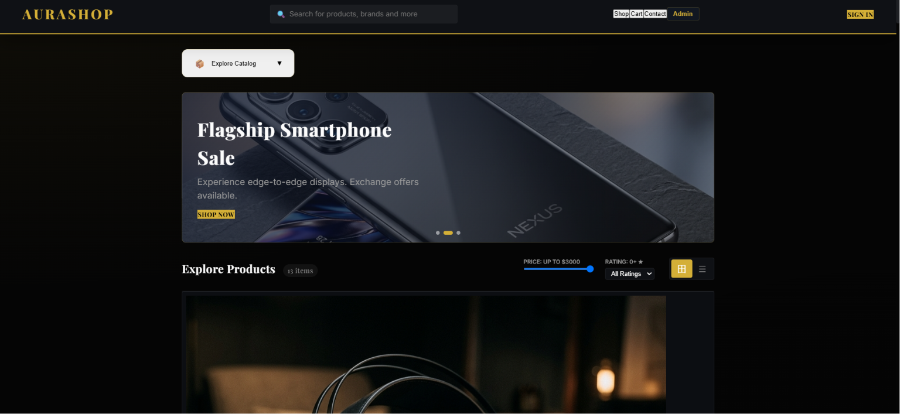
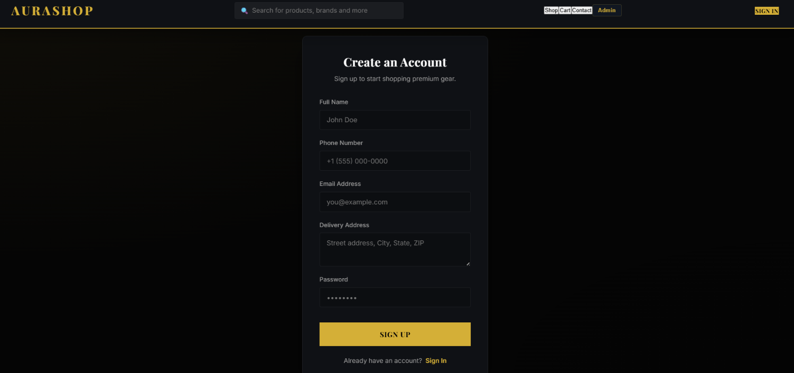
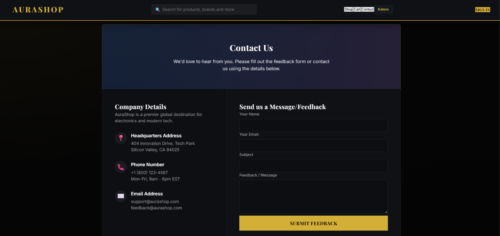
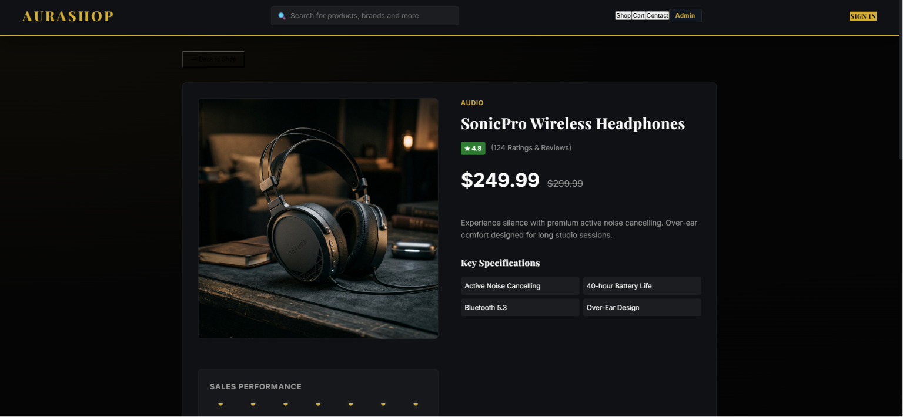

# 🛍️ Aura Luxe — Online Shopping & Order Management System

A full-stack web application for online shopping and order management, built as a **DBMS Mini-Project **. The platform supports user authentication, product browsing, cart management, order placement, and real-time order tracking — powered by a PostgreSQL relational database.

---

## 📖 About the Project

**Aura Luxe** is an Online Shopping and Order Management System developed to demonstrate the real-world application of **Database Management System (DBMS)** concepts including:

- Relational database design (normalization, foreign keys, constraints)
- CRUD operations via a RESTful API
- User authentication with JWT and password hashing (bcrypt)
- Full-stack integration with a React frontend and Node.js/Express backend

---

## 🛠️ Tech Stack

### Frontend
| Technology | Purpose |
|---|---|
| React (Vite) | UI Framework |
| React Router | Client-side Routing |
| CSS / Vanilla Styling | Styling & Animations |

### Backend
| Technology | Purpose |
|---|---|
| Node.js + Express | REST API Server |
| PostgreSQL | Relational Database |
| `pg` (node-postgres) | Database Driver |
| JWT (jsonwebtoken) | Authentication Tokens |
| bcryptjs | Password Hashing |
| dotenv | Environment Config |
| CORS | Cross-Origin Requests |

---

## 🗄️ Database Schema

The PostgreSQL database consists of **9 relational tables**:

```
users ──────────────────────────── (user_id, name, email, password, phone, address, role)
categories ──────────────────────── (category_id, category_name, category_description)
products ────────────────────────── (product_id, name, description, price, stock, category_id, image_url)
cart ────────────────────────────── (cart_id, user_id)
cart_items ──────────────────────── (cart_item_id, cart_id, product_id, quantity)
orders ──────────────────────────── (order_id, user_id, total_amount, status, order_date)
order_items ─────────────────────── (order_item_id, order_id, product_id, quantity, price)
payment ─────────────────────────── (payment_id, order_id, payment_method, payment_status, payment_date)
delivery ────────────────────────── (delivery_id, order_id, delivery_status, delivery_date)
```

### ER Diagram Overview

```
users (1) ──< cart (1) ──< cart_items >── products (1) ──< categories
  |
  └──< orders (1) ──< order_items >── products
           |
           ├── payment
           └── delivery
```

---

## ✨ Features

- 🔐 **User Authentication** — Register & Login with JWT-based session management
- 🛒 **Shopping Cart** — Add, update, and remove products from cart
- 📦 **Product Catalog** — Browse and filter products by category
- 📋 **Order Management** — Place orders and view order history
- 🚚 **Order Tracking** — Real-time delivery status updates
- 🛠️ **Admin Dashboard** — Manage products, view orders, update statuses
- 📱 **Responsive Design** — Works across desktop and mobile screens

---

## 📁 Project Structure

```
DBMS_PRO/
├── backend/
│   ├── config/             # Database connection config
│   ├── database/
│   │   ├── schema.sql      # PostgreSQL table definitions
│   │   ├── seed-luxe.js    # Seed script for luxe products
│   │   ├── seed-more.js    # Additional seed data
│   │   └── seed-products.js
│   ├── middleware/         # JWT auth middleware
│   ├── routes/
│   │   ├── auth.js         # Register / Login routes
│   │   ├── cart.js         # Cart CRUD routes
│   │   ├── orders.js       # Order management routes
│   │   ├── products.js     # Product listing routes
│   │   └── tracking.js     # Delivery tracking routes
│   └── server.js           # Express app entry point
│
├── frontend/
│   ├── public/
│   └── src/
│       ├── components/
│       │   ├── AdminDashboard.jsx
│       │   ├── Auth.jsx
│       │   ├── Cart.jsx
│       │   ├── Contact.jsx
│       │   ├── Footer.jsx
│       │   ├── Orders.jsx
│       │   ├── ProductDetails.jsx
│       │   ├── RecommendationPopup.jsx
│       │   └── Shop.jsx
│       ├── context/        # React Context (Auth/Cart state)
│       ├── App.jsx         # Main app with routing
│       └── main.jsx
│
├── api/
│   └── index.js            # Vercel serverless entry
├── vercel.json             # Vercel deployment config
└── package.json            # Root scripts (runs frontend + backend concurrently)
```

---

## 🚀 Getting Started

### Prerequisites

- [Node.js](https://nodejs.org/) (v18+)
- [PostgreSQL](https://www.postgresql.org/) (v14+)
- npm

### 1. Clone the Repository

```bash
git clone https://github.com/Sneka458/dbms-miniproject.git
cd dbms-miniproject/DBMS_PRO
```

### 2. Install Dependencies

```bash
npm run install-all
```

This installs packages for root, backend, and frontend.

### 3. Configure Environment Variables

Create a `.env` file inside the `backend/` folder:

```env
PORT=5000
DB_HOST=localhost
DB_PORT=5432
DB_USER=your_postgres_username
DB_PASSWORD=your_postgres_password
DB_NAME=your_database_name
JWT_SECRET=your_jwt_secret_key
```

### 4. Setup the Database

Open PostgreSQL and run the schema file:

```bash
psql -U your_postgres_username -d your_database_name -f backend/database/schema.sql
```

Then seed with sample product data:

```bash
npm run luxe-seed
```

### 5. Start the Application

```bash
npm run dev
```

This starts both the **backend** (port `5000`) and **frontend** (port `5173`) concurrently.

Open your browser at: **http://localhost:5173**

---

## 🔌 API Endpoints

### Auth
| Method | Endpoint | Description |
|--------|----------|-------------|
| POST | `/api/auth/register` | Register a new user |
| POST | `/api/auth/login` | Login and receive JWT |

### Products
| Method | Endpoint | Description |
|--------|----------|-------------|
| GET | `/api/products` | Get all products |
| GET | `/api/products/:id` | Get product by ID |

### Cart
| Method | Endpoint | Description |
|--------|----------|-------------|
| GET | `/api/cart` | Get user's cart |
| POST | `/api/cart/add` | Add item to cart |
| PUT | `/api/cart/update` | Update cart item quantity |
| DELETE | `/api/cart/remove/:id` | Remove item from cart |

### Orders
| Method | Endpoint | Description |
|--------|----------|-------------|
| POST | `/api/orders/place` | Place a new order |
| GET | `/api/orders` | Get user's order history |

### Tracking
| Method | Endpoint | Description |
|--------|----------|-------------|
| GET | `/api/tracking/:orderId` | Get delivery status for an order |

---

## 📸 Screenshots

### Home Page



### Signup Page



### Contact



### Cart




> ⭐ If you found this project helpful, feel free to star the repository!
